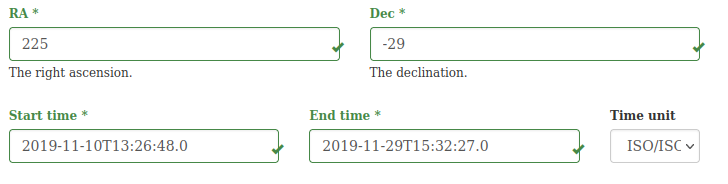
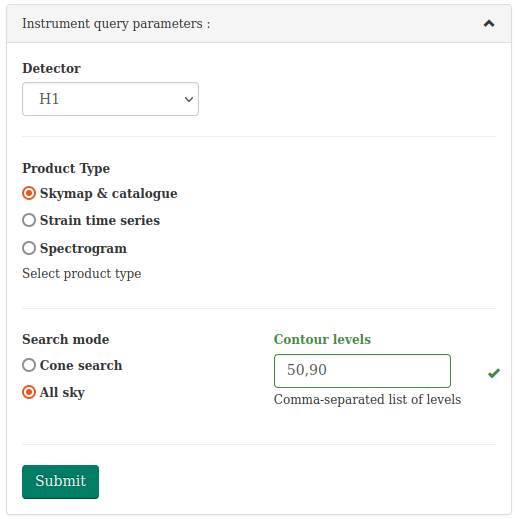
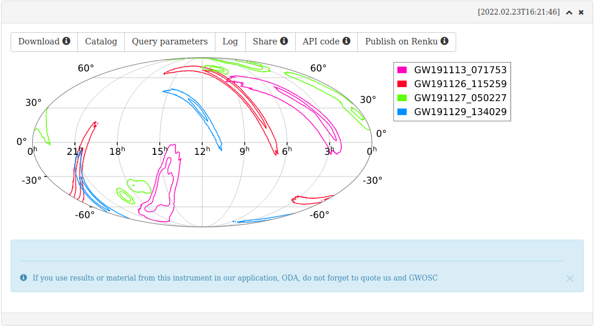
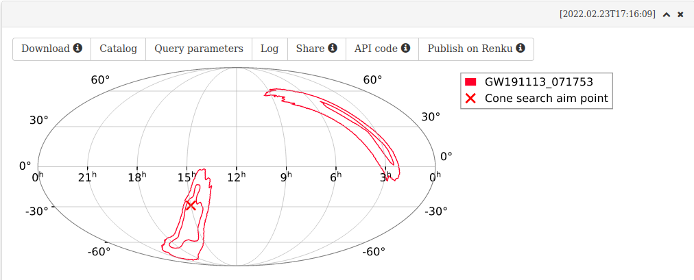
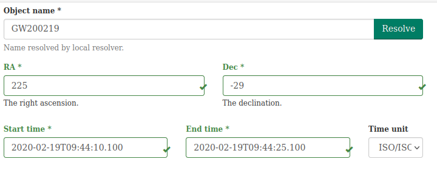
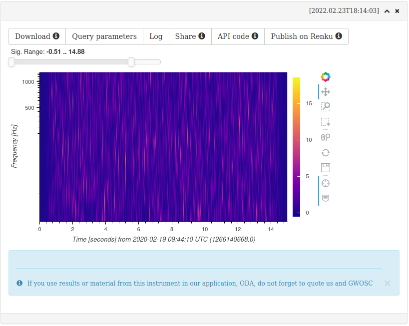

This interface provides the analysis of publicly available gravitational wave data of LIGO and VIRGO detectors available from https://gw-openscience.org. The data analysis workflows implemented as online services follow the methods of the tutorial analysis notebooks of https://www.gw-openscience.org/tutorials/ . The services provides a possibility to execute the tutorial notebooks for any time interval (with or without known gravitational wave events) and any detector. 

## Source query panel

The general MMODA interface for all instruments has a top-level selection panel that allows to specify sky position of an astronomical source and/or time interval for the analysis. 

It also uses skymaps from
- https://dcc.ligo.org/LIGO-P1800381/public for GWTC1 events
- "PublicationSamples" skymaps from https://dcc.ligo.org/LIGO-P2000223/public/ for GWTC2 events
- Mixed-model skymaps from https://zenodo.org/record/5546663 for GWTC3
  

## Skymap and catalog
To plot the probability contours of the GW events in the specified time range:
   1. Specify the time range in general parameter form.
      
   2. Select contour levels to plot.
      

The result is as follows:

To download archive with raw MOC skymaps and event catalog. 

Catalog button shows events

### Cone search
In more advanced mode one can restrict the returned events to those, whose probabilty contours intersect with circular region on sky:
   1. In addition to the time range specify coordinates of sky direction
   2. Select cone-search mode
   3. Set probability level and radius

## Time series data
This mode is used to obtain strain time-series for some GW event.
1. Specify GW event name and press Resolve button – the time interval will be filled accordingly
   
2. Select GW detector and specify bandpass limits
   

The result is:

Upper plot shows raw data and the bottom one shows bandpassed and whitened data. The corresponding .h5 files can be downloaded.

## Spectrogram
It is also possible to obtain the Constant-Q transform of the data. The steps are similar to the time-series case. 

The result looks like the following:

