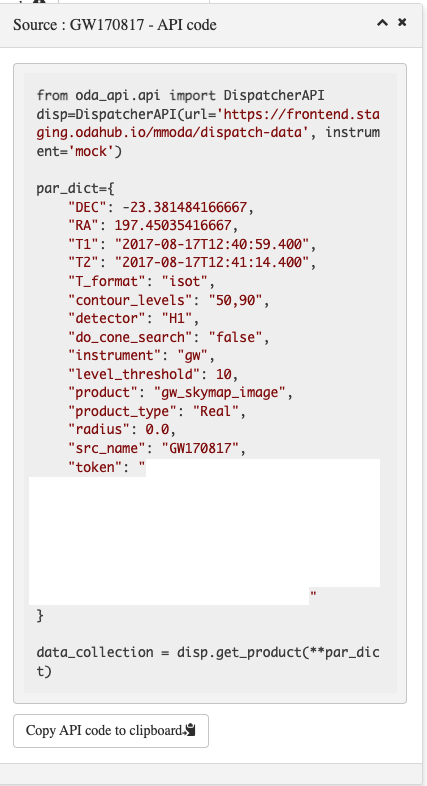

This interface provides the analysis of publicly available gravitational wave data of LIGO and VIRGO detectors available from https://gw-openscience.org. The data analysis workflows implemented as online services follow the methods of the tutorial analysis notebooks of https://www.gw-openscience.org/tutorials/ . The services provides a possibility to execute the tutorial notebooks for an arbitrary time interval 
(with or without known gravitational wave events) and detector. 
  
## Source query panel

The general MMODA interface for all instruments has a top-level selection panel that allows to specify sky position of an astronomical source and/or time interval for the analysis. For the gravitational wave events, it is the time interval that is most important. It provides unique identification of known events. The top common parameter panel of the MMODA interface allows to directly enter the time interval in the dedicated parameter windows.  
      
      
Alternatively, the time intervals for the known gravitational wave events can be found using the name resolver. The user can enter the name of the event (e.g. GW170817) and click "resolve" button. If the event is known to the resolver, the time interval of the event will appear in the time selection parameter windows. By default, the sky direction will not be resolved (because of the limited sky localisation capability of the gravitational wave detectors). The GW170817 event for which the direction is known is an exception. 

## Skymap and catalog

The interface allows to find known gravitational wave events within a specified time interval and visualise their sky localisations. This can be done by selecting the "skymap and catalog" in the side parameter panel. It is also possible to perform a cone search for events around a selected sky direction by selecting the "cone search" and specifying the angular width of the search cone. Otherwise, an all-sky search can be performed:   

(WHAT IS THE "LEVEL THRESHOLD"?) 

The analysis uses the skymaps from https://dcc.ligo.org/LIGO-P1800381/public for the first Gravitational Wave Transient Catalog (GWTC1) events as well as "PublicationSamples" skymaps from https://dcc.ligo.org/LIGO-P2000223/public/ for GWTC2 events and "mixed-model" skymaps from https://zenodo.org/record/5546663 for GWTC3. The original skymap data are fits files with the probability density function (PDF) for event localisation in the [MOC HEALPix](https://www.ivoa.net/documents/MOC/20190215/WD-MOC-1.1-20190215.pdf) format with the additional HEALPix layers representing the conditional mean and standard deviation of distance as a function of sky location. The online data analysis service presents the 2-d PDF in the form of a contour plot:

The probability levels for the contour plot can be specified in the side parameter panel. The result display window has a number of buttons that allow to manipulate the skymap data products. The "Download" button provides a possibility to download the original skymap PDF for all the displayed events. The MMODA interface can be accessed from Python notebooks, using a an API. The API code for the skymap can be retreived by pressing the "API code" button. The result will be a piece of a Python code like this:

It is possibly to directly deploy a Jupyter notebook with the API code to retreive the data product at one of the online notebook servers. The MMODA interface currently provides a possibility to run notebooks on Renku platform provided by Swiss Data Science Centre https://renkulab.io/. This can be done by pressing the "Publish on Renku" button.

The list of events displayed in the image can be retreived by pressing the "Catalog" button

The catalog table lists the event name, its GPS time as well as the masses of the merging bodies in the coalescing binary system.

## Time series data

Apart from sky maps, it is possible to obtain strain time-series for different gravitational wave detectors. This can be done by selecting "Strain time series" button in the side parameter panel:

   
This will display additional option for whitening of the time series data. It is possible to select the bandpass filter by specifying minimal and maximal frequency. 
Pressing the "Submit" button will launch the online analysis and produce the result that will look like this:

The result display includes two panels, with the upper plot showing the raw data and the bottom one showing the filtered and whitened data. 

Similarly to the skymap display, the time series data can be downloaded by clicking on "Download" button. 

## Spectrogram
It is also possible to obtain the spectrogram: the time evolution of the frequency, obtained via Constant-Q transform of the data. To generate the spectrogram, select the "Spectrogram" in the side parameter panel and specify the lower and upper Q values:

Press "Submit" button to generate the data product:

Similarly to the sky map and time series, the spectrogram can be downloaded by pressing the "Download" button. It can be also retrieved using a Python API code that can be found by pressing the "API code" button. The API code can be also executed online by pressing the "Publish on Renku" button. 
